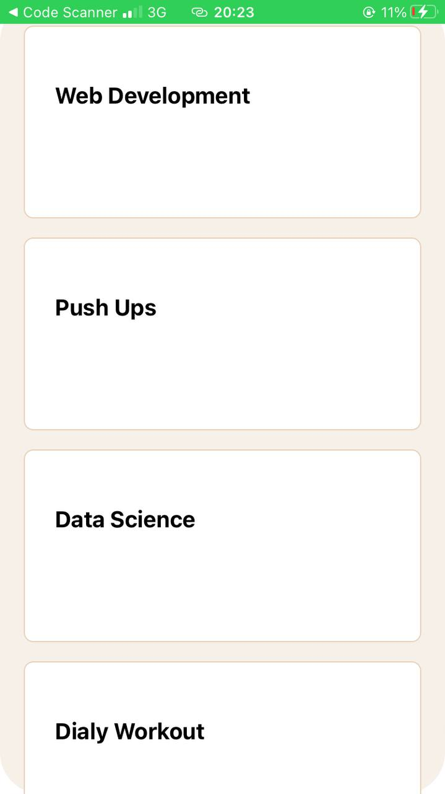
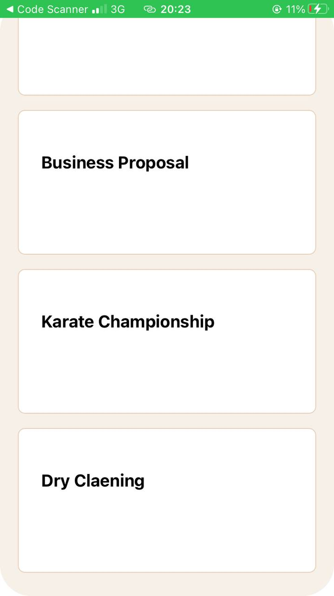

# rn-assignment3-11253767

## Mobile Application Development Assignment 3

### Overview
This repository contains the implementation of Assignment 3 for the Mobile Application Development course (DCIT202). The goal of this assignment is to recreate a provided UI mockup using React Native. The application includes a list of tasks categorized into different sections and styled to closely match the given design.

### Components

#### 1. **View**
- Used as a container for other components to layout the structure of the app.

#### 2. **Text**
- Displays textual information such as titles, subtitles, and task descriptions.

#### 3. **ScrollView**
- Allows for scrolling through the list of categories and tasks, enabling better navigation and user experience.

#### 4. **TextInput**
- Provides input fields for users to add or edit tasks.

#### 5. **Stylesheet**
- Defines the styles used across the application, ensuring a consistent look and feel.

#### 7. **SectionList**
- Renders a list of tasks efficiently, supporting large data sets and smooth scrolling.

#### 8. **Image**
- Displays icons and images related to the categories and tasks, enhancing the visual appeal of the app.

### Categories
The application includes the following eight categories:
- Exercise
- Study
- Coding
- Cook
- Dance
- Music
- Laundry
- Karate
- Soccer 

### Section List
The application provides a list of 15 ongoing tasks, each associated with one of the categories mentioned above.

### Custom Components
To improve code modularity and reusability, custom components have been created, including:
- **Cards**: Represents a single card.
- **Frame1**: Represents the header of the App.
- **Search**: Displays the search area of the app.

### Repository Structure
The repository is organized as follows:
- **/Images**: Contains images and icons used in the application.
- **/components**: Contains custom components.
- **/screenshot**: Contains the main screen of the application.
- **App.js**: Entry point of the application.

### Screenshots




### Instructions
1. Clone the repository to your local machine:
   ```sh
   git clone https://github.com/CyrilAshong/rn-assignment3-11253767.git
